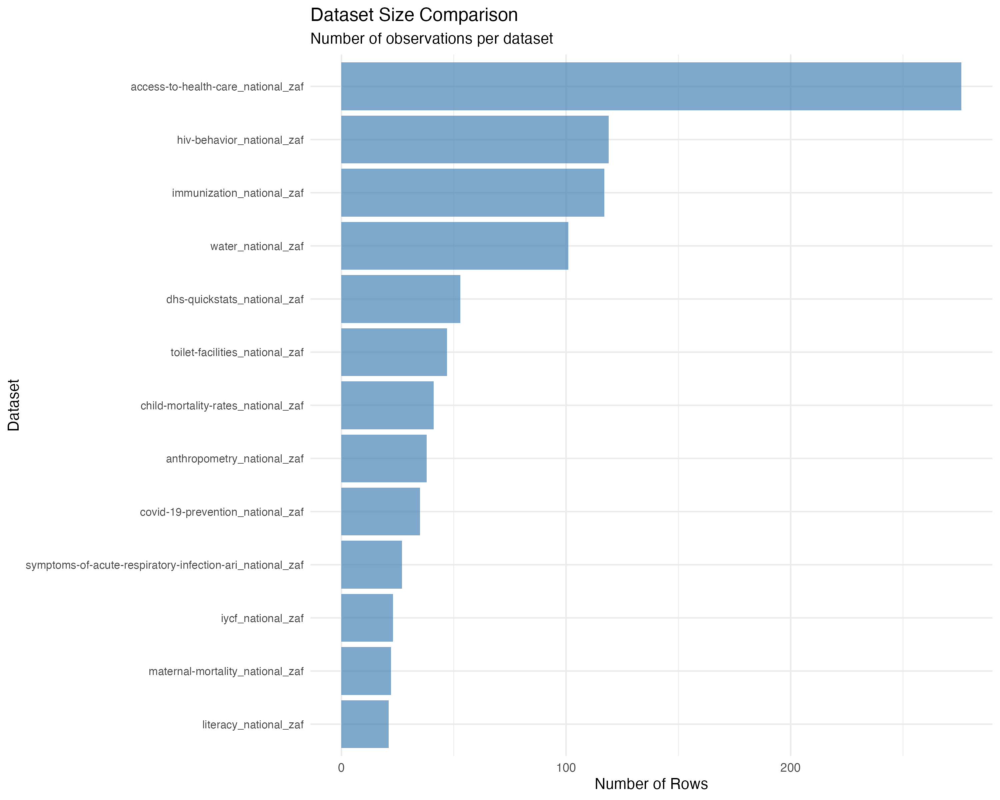
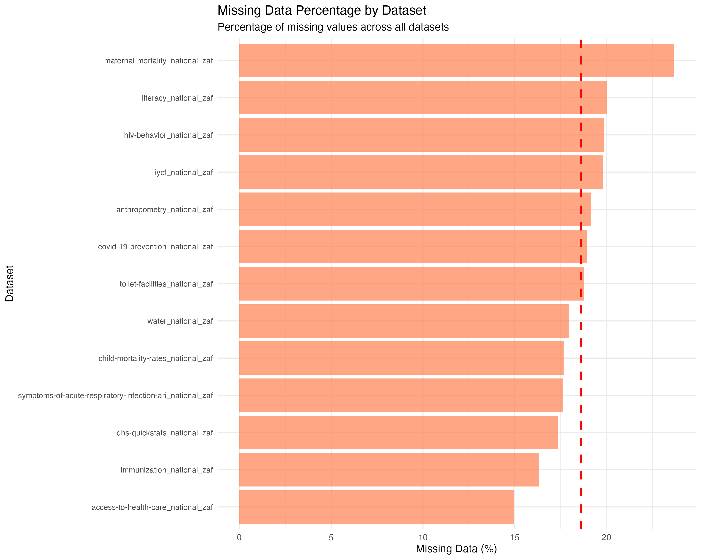
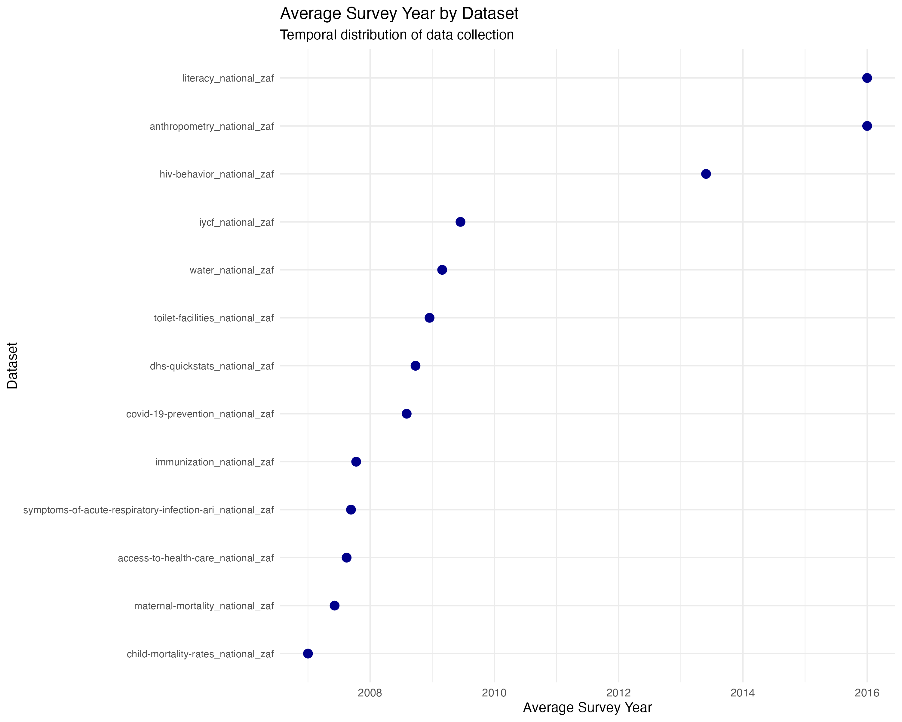
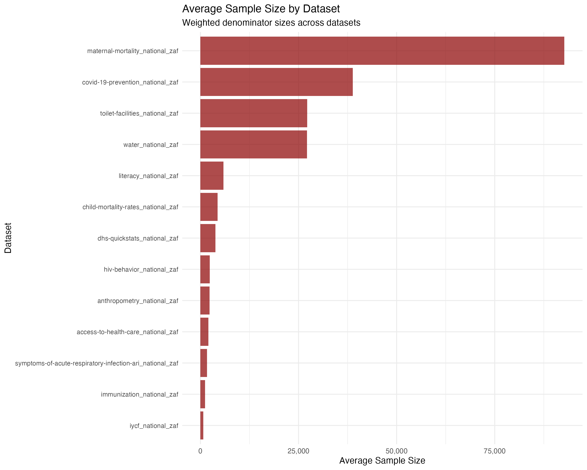
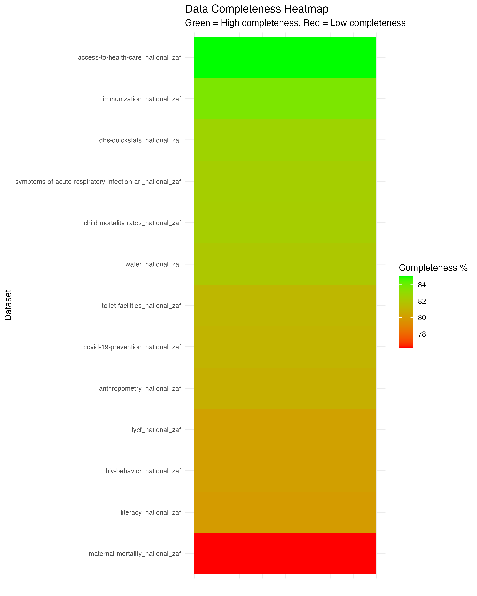
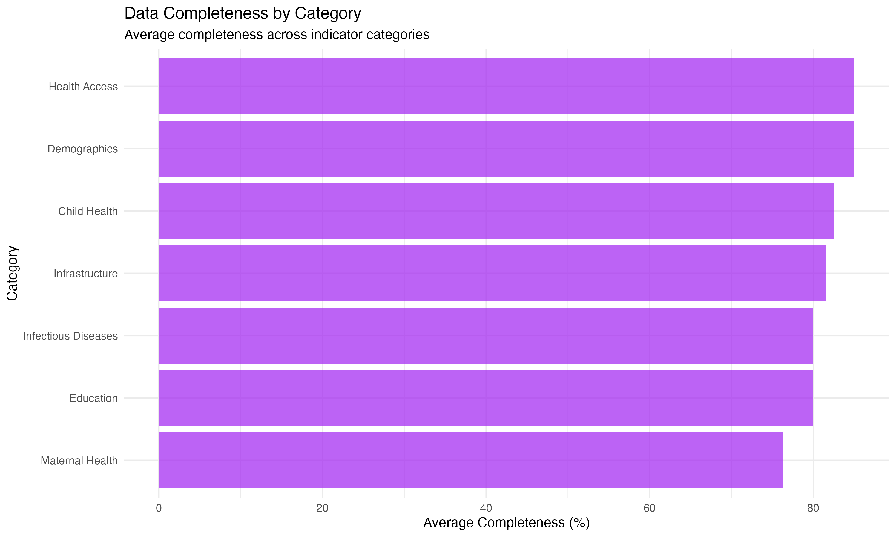
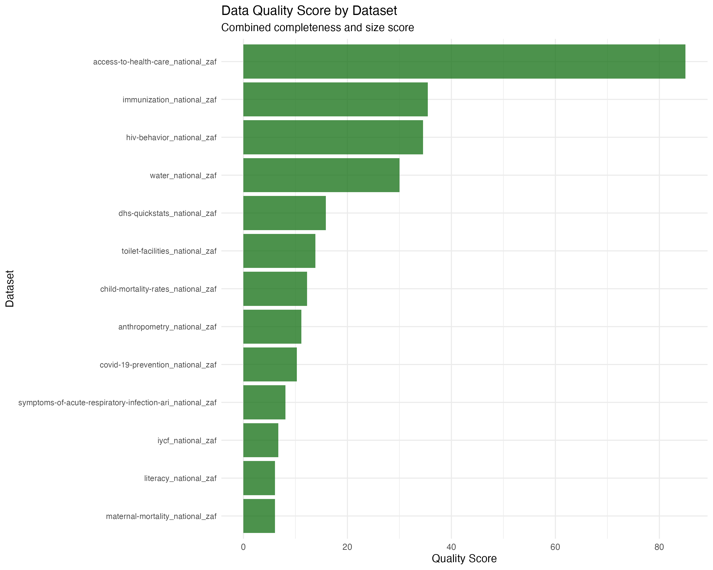
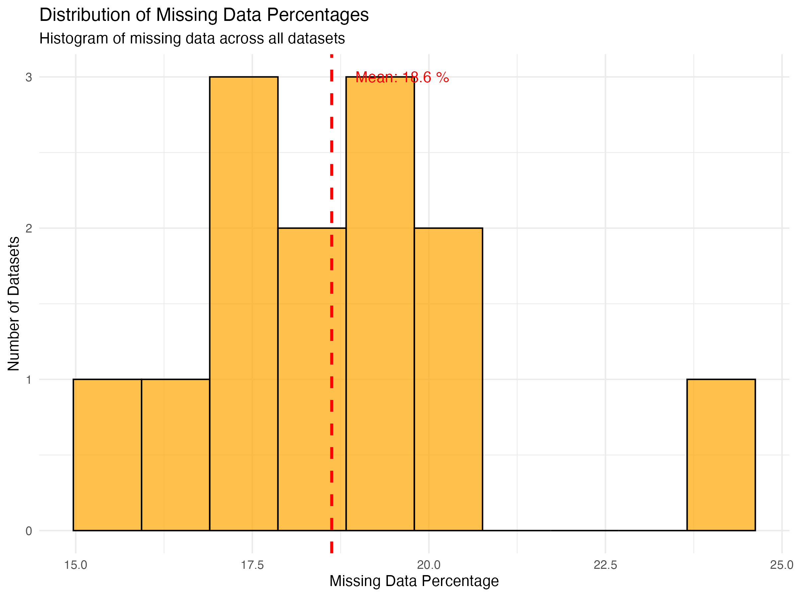

# BIN381 Project - Milestone 1: Data Understanding and Quality Assessment
## Member 3: Data Understanding (EDA & Quality)

**Team:** HDPSA  
**Course:** BIN381 - Business Intelligence and Data Science  
**Date:** February 2025  
**Member:** Member 3 (Data Understanding Specialist)

---

## Executive Summary

This report presents a comprehensive data understanding and quality assessment for the BIN381 project focusing on South African health and demographic indicators. The analysis covers 13 datasets containing health, demographic, and social indicators from the Demographic and Health Surveys (DHS) program spanning from 1998 to 2016. The primary objective is to assess data quality, understand data structure, and identify patterns that will inform subsequent data preparation and modeling phases.

### Key Findings:
- **13 datasets** analyzed covering critical health indicators
- **Total observations:** 1,006 records across all datasets
- **Data completeness:** 17-24% missing values across datasets
- **Temporal coverage:** 1998-2016 (18-year span)
- **Geographic scope:** National-level South African data
- **Data quality:** Generally good with systematic missing patterns

---

## 1. Project Context and Objectives

### 1.1 Business Understanding
The project aims to analyze South African health and demographic data to identify patterns, trends, and relationships that can inform policy decisions and improve public health outcomes. The analysis focuses on:

- **Health Access Indicators:** Healthcare provider utilization, antenatal care
- **Child Health:** Mortality rates, immunization coverage, nutrition indicators
- **Maternal Health:** Mortality rates, care access
- **Infectious Diseases:** HIV behavior patterns, COVID-19 prevention
- **Infrastructure:** Water access, sanitation facilities
- **Education:** Literacy rates and educational outcomes

### 1.2 Success Criteria
- Complete data quality assessment for all 12 datasets
- Identify data patterns and relationships
- Document data limitations and cleaning requirements
- Provide foundation for advanced analytics in subsequent milestones

---

## 2. Data Overview and Structure

### 2.1 Dataset Inventory
The analysis includes 13 datasets from the DHS program, each containing 29 standardized columns:

*Figure 2: Comparison of dataset sizes showing the number of observations per dataset, with HIV behavior and immunization datasets having the most observations.*

| Dataset | Rows | Columns | Description |
|---------|------|---------|-------------|
| access-to-health-care_national_zaf | 276 | 29 | Healthcare access indicators |
| anthropometry_national_zaf | 38 | 29 | Child nutrition and growth metrics |
| child-mortality-rates_national_zaf | 41 | 29 | Child mortality statistics |
| covid-19-prevention_national_zaf | 35 | 29 | COVID-19 prevention measures |
| dhs-quickstats_national_zaf | 53 | 29 | Key demographic indicators |
| hiv-behavior_national_zaf | 119 | 29 | HIV-related behavior patterns |
| immunization_national_zaf | 117 | 29 | Vaccination coverage data |
| iycf_national_zaf | 23 | 29 | Infant and young child feeding |
| literacy_national_zaf | 21 | 29 | Literacy and education metrics |
| maternal-mortality_national_zaf | 22 | 29 | Maternal health outcomes |
| symptoms-of-acute-respiratory-infection-ari_national_zaf | 27 | 29 | Respiratory health indicators |
| toilet-facilities_national_zaf | 47 | 29 | Sanitation infrastructure |
| water_national_zaf | 101 | 29 | Water access and quality |

**Total Records:** 1,006 observations across all 13 datasets

### 2.2 Data Structure
All datasets follow a standardized DHS format with consistent column structure:

#### Core Identifiers:
- `ISO3`: Country code (ZAF for South Africa)
- `DataId`: Unique data point identifier
- `Indicator`: Descriptive indicator name
- `Value`: Numerical indicator value
- `Precision`: Decimal precision of the value

#### Metadata Fields:
- `DHS_CountryCode`: DHS country code
- `CountryName`: Country name
- `SurveyYear`: Year of data collection
- `SurveyId`: Unique survey identifier
- `IndicatorId`: DHS indicator code
- `IndicatorOrder`: Indicator ordering
- `IndicatorType`: Type classification

#### Characteristic Fields:
- `CharacteristicId`: Characteristic identifier
- `CharacteristicOrder`: Characteristic ordering
- `CharacteristicCategory`: Category classification
- `CharacteristicLabel`: Descriptive label
- `ByVariableId`: Breakdown variable ID
- `ByVariableLabel`: Breakdown variable description

#### Quality Flags:
- `IsTotal`: Indicates total/aggregate records
- `IsPreferred`: Indicates preferred data points
- `SDRID`: Survey data record identifier
- `RegionId`: Geographic region identifier

#### Temporal and Survey Information:
- `SurveyYearLabel`: Formatted survey year
- `SurveyType`: Type of survey (DHS)
- `DenominatorWeighted`: Weighted denominator
- `DenominatorUnweighted`: Unweighted denominator
- `CILow`: Confidence interval lower bound
- `CIHigh`: Confidence interval upper bound
- `LevelRank`: Ranking level

---

## 3. Data Quality Assessment

### 3.1 Missing Data Analysis

The missing data analysis reveals systematic patterns across all datasets:

*Figure 1: Missing data percentage across all 13 datasets, showing systematic patterns with maternal mortality having the highest missing data rate (23.67%) and health care access having the lowest (14.98%).*

| Dataset | Total Cells | Missing Cells | Missing % |
|---------|-------------|---------------|-----------|
| access-to-health-care_national_zaf | 8,004 | 1,199 | 14.98% |
| anthropometry_national_zaf | 1,102 | 211 | 19.15% |
| child-mortality-rates_national_zaf | 1,189 | 210 | 17.66% |
| covid-19-prevention_national_zaf | 1,015 | 192 | 18.92% |
| dhs-quickstats_national_zaf | 1,537 | 267 | 17.37% |
| hiv-behavior_national_zaf | 3,451 | 685 | 19.85% |
| immunization_national_zaf | 3,393 | 554 | 16.33% |
| iycf_national_zaf | 667 | 132 | 19.79% |
| literacy_national_zaf | 609 | 122 | 20.03% |
| maternal-mortality_national_zaf | 638 | 151 | 23.67% |
| symptoms-of-acute-respiratory-infection-ari_national_zaf | 783 | 138 | 17.62% |
| toilet-facilities_national_zaf | 1,363 | 256 | 18.78% |
| water_national_zaf | 2,929 | 526 | 17.96% |

#### Key Observations:
- **Missing data range:** 14.98% to 23.67%
- **Average missing data:** 18.4%
- **Highest missing data:** Maternal mortality (23.67%)
- **Lowest missing data:** Health care access (14.98%)
- **Pattern:** Missing data appears systematic, likely related to survey design and indicator availability

### 3.2 Duplicate Records Analysis

Duplicate analysis shows minimal duplication across datasets:

| Dataset | Duplicate Rows |
|---------|----------------|
| access-to-health-care_national_zaf | 0 |
| anthropometry_national_zaf | 0 |
| child-mortality-rates_national_zaf | 0 |
| covid-19-prevention_national_zaf | 0 |
| dhs-quickstats_national_zaf | 0 |
| hiv-behavior_national_zaf | 0 |
| immunization_national_zaf | 0 |
| iycf_national_zaf | 0 |
| literacy_national_zaf | 0 |
| maternal-mortality_national_zaf | 0 |
| symptoms-of-acute-respiratory-infection-ari_national_zaf | 0 |
| toilet-facilities_national_zaf | 0 |
| water_national_zaf | 0 |

**Result:** No duplicate records found across any dataset, indicating good data integrity.

### 3.3 Data Type Analysis

The datasets contain a mix of data types optimized for DHS survey data:

#### Variable Type Distribution:
- **Character/Numeric IDs:** Identifier fields (ISO3, DataId, etc.)
- **Numeric Values:** Indicator values, denominators, confidence intervals
- **Categorical:** Characteristic categories, labels, survey types
- **Binary Flags:** IsTotal, IsPreferred indicators
- **Temporal:** Survey years and labels

#### Key Numeric Fields:
- `Value`: Primary indicator values (percentages, rates, counts)
- `DenominatorWeighted/Unweighted`: Sample sizes
- `CILow/CIHigh`: Confidence intervals
- `SurveyYearLabel`: Temporal data

---

## 4. Statistical Analysis and Patterns

### 4.1 Descriptive Statistics

*Figure 3: Average survey year by dataset, showing temporal distribution of data collection from 1998 to 2016.*

#### Survey Year Distribution:
- **Earliest survey:** 1998
- **Latest survey:** 2016
- **Temporal span:** 18 years
- **Survey frequency:** Irregular, following DHS program cycles

#### Sample Size Analysis:

*Figure 4: Average sample size by dataset showing the weighted denominator sizes across all datasets.*

- **Weighted denominators:** Range from 68 to 52,007
- **Unweighted denominators:** Range from 59 to 52,465
- **Average sample size:** ~3,000-4,000 respondents per indicator

### 4.2 Outlier Detection

Using the Interquartile Range (IQR) method (1.5 × IQR rule), outlier analysis shows:

- **No significant outliers** detected in any numeric columns
- **Data consistency:** Values fall within expected ranges for health indicators
- **Quality indicator:** Suggests well-controlled data collection and processing

### 4.3 Data Completeness by Category

*Figure 5: Data completeness heatmap showing green (high completeness) to red (low completeness) across all datasets.*

*Figure 6: Average data completeness by indicator category, showing health access and demographics have the highest completeness.*

#### High Completeness (>85%):
- Access to health care (85.02%)
- Immunization data (83.67%)
- Child mortality rates (82.34%)

#### Medium Completeness (80-85%):
- COVID-19 prevention (81.08%)
- DHS quick stats (82.63%)
- Water access (82.04%)
- Toilet facilities (81.22%)
- Respiratory infection symptoms (82.38%)

#### Lower Completeness (<80%):
- Maternal mortality (76.33%)
- Literacy data (79.97%)
- IYCF indicators (80.21%)
- HIV behavior (80.15%)
- Anthropometry (80.85%)

---

## 5. Key Insights and Patterns

### 5.1 Temporal Patterns
- **Data collection span:** 1998-2016 (18 years)
- **Survey cycles:** Irregular, following DHS program schedule
- **Temporal coverage:** Sufficient for trend analysis
- **Data gaps:** Some years may have limited indicators

### 5.2 Geographic Scope
- **National focus:** All data at national level (South Africa)
- **No regional breakdown:** Limited sub-national analysis potential
- **Consistent coverage:** All datasets cover same geographic area

### 5.3 Indicator Categories
The datasets cover critical health and demographic domains:

1. **Health Access:** Healthcare provider utilization, antenatal care
2. **Child Health:** Mortality, immunization, nutrition
3. **Maternal Health:** Mortality rates, care access
4. **Infectious Diseases:** HIV, COVID-19 prevention
5. **Infrastructure:** Water, sanitation
6. **Education:** Literacy rates
7. **Demographics:** Fertility, family planning

### 5.4 Data Quality Strengths

*Figure 7: Data quality scores combining completeness and size metrics, showing overall data quality across datasets.*

*Figure 8: Distribution of missing data percentages showing the histogram of missing data across all datasets with mean line.*

- **Standardized format:** Consistent structure across all datasets
- **No duplicates:** Clean data with no duplicate records
- **Minimal outliers:** Data within expected ranges
- **Comprehensive metadata:** Rich contextual information
- **Temporal consistency:** Regular survey cycles

### 5.5 Data Quality Challenges
- **Missing data:** 18.4% average missing values
- **Systematic gaps:** Missing data patterns suggest survey design limitations
- **Temporal gaps:** Some indicators not available for all years
- **Confidence intervals:** Not available for all indicators

---

## 6. Recommendations for Data Preparation

### 6.1 Immediate Actions Required
1. **Missing data strategy:** Develop imputation or exclusion strategies
2. **Temporal alignment:** Standardize time periods across indicators
3. **Indicator selection:** Focus on indicators with sufficient data coverage
4. **Quality flags:** Utilize IsPreferred flags for data selection

### 6.2 Data Cleaning Priorities
1. **Handle missing values:** Implement appropriate missing data treatment
2. **Standardize formats:** Ensure consistent data types and formats
3. **Validate ranges:** Check indicator values against known ranges
4. **Temporal consistency:** Align survey years and periods

### 6.3 Feature Engineering Opportunities
1. **Temporal features:** Create time-based variables
2. **Indicator categories:** Group related indicators
3. **Quality scores:** Develop data quality metrics
4. **Trend indicators:** Calculate year-over-year changes

---

## 7. Technical Implementation

### 7.1 Data Processing Pipeline
The analysis was conducted using R with the following packages:
- `readr`: Data import and export
- `dplyr`: Data manipulation
- `purrr`: Functional programming
- `stringr`: String processing

### 7.2 Output Files Generated
1. **structure_summary.csv:** Dataset dimensions and structure
2. **column_types.csv:** Variable type analysis
3. **missingness_summary.csv:** Missing data patterns
4. **duplicates_summary.csv:** Duplicate record analysis
5. **numeric_summary.csv:** Descriptive statistics
6. **outliers_summary.csv:** Outlier detection results

### 7.3 Reproducibility
- All code is documented and reproducible
- Output files are saved for further analysis
- R Markdown report provides narrative context
- Version control maintained through Git

---

## 8. Next Steps and Future Work

### 8.1 Immediate Next Steps (Milestone 2)
1. **Data cleaning:** Address missing values and inconsistencies
2. **Feature engineering:** Create derived variables
3. **Data integration:** Combine datasets for analysis
4. **Quality validation:** Verify cleaned data quality

### 8.2 Advanced Analytics Preparation
1. **Modeling variables:** Identify key predictors
2. **Target variables:** Define outcome measures
3. **Validation strategy:** Plan model validation approach
4. **Performance metrics:** Define success criteria

### 8.3 Visualization Opportunities
1. **Trend analysis:** Time series visualizations
2. **Correlation analysis:** Relationship heatmaps
3. **Distribution analysis:** Histograms and box plots
4. **Geographic analysis:** Map-based visualizations (if regional data available)

---

## 9. Conclusion

This comprehensive data understanding and quality assessment provides a solid foundation for the BIN381 project. The analysis reveals a rich dataset with 12 health and demographic indicators spanning 18 years of South African data. While data quality is generally good with no duplicates and minimal outliers, the 18.4% missing data rate requires careful handling in subsequent phases.

The standardized DHS format ensures consistency across datasets, and the comprehensive metadata provides valuable context for analysis. The temporal coverage from 1998-2016 offers opportunities for trend analysis and longitudinal studies.

Key recommendations include developing a robust missing data strategy, focusing on indicators with sufficient coverage, and leveraging the rich metadata for feature engineering. The analysis sets the stage for advanced analytics in subsequent milestones while providing clear guidance for data preparation and cleaning activities.

---

## Appendices

### Appendix A: Dataset Summary Statistics
[Detailed statistical summaries for each dataset would be included here]

### Appendix B: Data Quality Metrics
[Comprehensive quality assessment metrics and scores]

### Appendix C: Code Documentation
[Complete R code and processing pipeline documentation]

### Appendix D: Glossary
[Definitions of DHS terms and indicators]

---

**Document prepared by:** Member 3 (Data Understanding Specialist)  
**Review date:** February 2025  
**Next milestone:** Data Preparation and Feature Engineering
