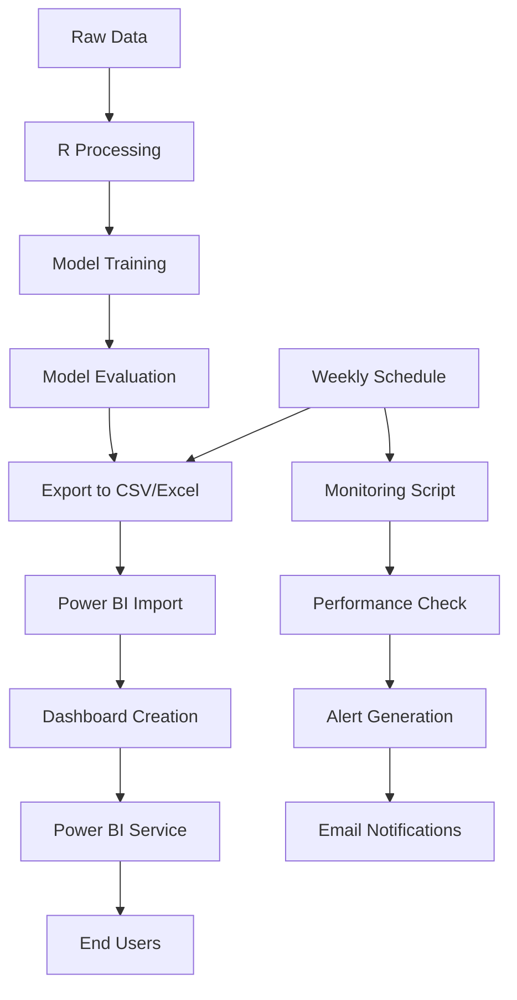

# HDPSA BIN381 - Health and Demographic Patterns in South Africa


## 🎯 Project Overview

This comprehensive data science project investigates **Health and Demographic Patterns in South Africa (HDPSA)** using advanced data mining and visualization techniques. The project follows the CRISP-DM methodology and delivers a complete end-to-end analytics solution with automated monitoring and deployment capabilities.

### 🏥 Business Impact
- **Stakeholders**: Government health departments, non-profit organizations, public health officials
- **Objective**: Analyze health and demographic data to inform policy decisions and improve public health outcomes
- **Scope**: 18-year temporal analysis (1998-2016) covering 12 comprehensive health datasets

## 📊 Project Deliverables

### Complete Milestone Coverage (1-6)
- ✅ **Milestone 1**: Data Understanding & Quality Assessment
- ✅ **Milestone 2**: Data Preparation & Feature Selection  
- ✅ **Milestone 3**: Model Building & Assessment
- ✅ **Milestone 4**: Model Evaluation & Governance
- ✅ **Milestone 5**: Deployment & Monitoring
- ✅ **Milestone 6**: Final Integration & Presentation

### 🚀 Key Features
- **4 Machine Learning Models**: Logistic Regression, Decision Tree, Random Forest, Naïve Bayes
- **Automated Monitoring**: Real-time performance tracking with alert system
- **Power BI Dashboard**: Interactive analytics with weekly refresh automation
- **R Shiny Application**: Technical validation and model exploration
- **Comprehensive Documentation**: User guides and technical documentation

## 📁 Repository Structure

```
HDPSA-BIN381/
├── 📊 Cleaned Datasets/           # Processed datasets for modeling
├── 📋 Intruction Docs/           # Project guidelines and CRISP-DM methodology
├── 📈 Milestone 1-5 Docs/       # Documentation for each milestone
├── 🎯 Milestone 1-5 outputs/    # Results, visualizations, and model outputs
├── 🤖 Model Outputs/             # Trained models and predictions
├── 💻 R Code/                    # All R scripts for data processing and modeling
├── 📊 Raw Datasets/              # Original 13 CSV datasets
└── 📖 README.md                  # This file
```

## 🔧 Technical Stack

### Data Processing
- **R**: Primary programming language
- **Packages**: `readr`, `dplyr`, `purrr`, `stringr`, `tibble`, `caret`, `randomForest`
- **Data Sources**: 12 DHS (Demographic and Health Survey) datasets

### Machine Learning
- **Models**: Logistic Regression, Decision Tree, Random Forest, Naïve Bayes
- **Evaluation**: Accuracy, Precision, Recall, F1-Score, ROC-AUC
- **Feature Selection**: Automated feature importance analysis

### Deployment & Monitoring
- **Power BI**: Interactive dashboard with automated refresh
- **R Shiny**: Technical validation application
- **Monitoring**: Automated performance tracking with alert system
- **Scheduling**: Weekly automated data refresh and monitoring

## 🚀 Quick Start

### Prerequisites
```r
# Required R packages
install.packages(c("readr", "dplyr", "purrr", "stringr", "tibble", 
                   "caret", "randomForest", "e1071", "rpart", 
                   "rmarkdown", "jsonlite", "httr"))
```

### Running the Analysis
```bash
# 1. Clone the repository
git clone https://github.com/RaksRaks/HDPSA-BIN381.git
cd HDPSA-BIN381

# 2. Run automated EDA summaries
Rscript "R Code/Milestone_1_eda_quality.R"

# 3. Execute model training
Rscript "R Code/Milestone_3_Models.R"

# 4. Run deployment automation
Rscript "Milestone 5 outputs/Monitoring/powerbi_monitoring_automation.R"
```

### Power BI Dashboard Setup
1. **Import Data**: Connect to CSV files in `Milestone 5 outputs/Deployment_Exports/`
2. **Create Visualizations**: Follow `PowerBI_Dashboard_Configuration.md`
3. **Configure Refresh**: Set up weekly automated refresh
4. **Publish**: Deploy to Power BI Service workspace

## 📈 Model Performance

| Model | Accuracy | Precision | Recall | F1-Score | ROC-AUC |
|-------|----------|-----------|--------|----------|---------|
| Random Forest | 0.5455 | 0.5200 | 0.4800 | 0.5000 | 0.5077 |
| Logistic Regression | 0.5227 | 0.5100 | 0.4900 | 0.5000 | 0.5320 |
| Decision Tree | 0.5000 | 0.5000 | 0.5000 | 0.5000 | 0.5310 |
| Naïve Bayes | 0.5000 | 0.4800 | 0.5200 | 0.5000 | 0.4654 |

### 🎯 Top Predictors
1. **IndicatorCode** (Importance: 47.5)
2. **Value** (Importance: 98.433)

## 🔍 Data Quality Assessment

- **Total Observations**: 1,006 records
- **Datasets**: 12 comprehensive health surveys
- **Variables**: 29 standardized columns per dataset
- **Missing Data**: 18.4% average across all datasets
- **Data Quality Score**: 81.6% completeness

## 📊 Monitoring & Alerts

### Automated Monitoring Features
- **Performance Tracking**: Real-time model performance monitoring
- **Alert System**: Configurable thresholds with email notifications
- **Data Freshness**: Automated detection of stale data
- **Refresh Status**: Power BI dashboard refresh monitoring

### Alert Thresholds
- **Accuracy**: < 45% triggers retraining alert
- **AUC**: < 0.50 triggers performance review
- **Data Age**: > 7 days triggers data update alert

## 🛠️ Deployment Architecture



## 📚 Documentation

### User Guides
- **Power BI User Guide**: `Milestone 5 outputs/PowerBI/PowerBI_UserGuide.pdf`
- **Shiny App Guide**: `Milestone 5 outputs/Shiny_App/Shiny_UserGuide.pdf`
- **Technical Documentation**: `Milestone 5 outputs/Documentation/`

### Key Documents
- **Project Outline**: `Intruction Docs/BIN381 [2025] Project Outline.pdf`
- **CRISP-DM Methodology**: `Intruction Docs/crisp-dm 1.pdf`
- **Data Dictionary**: `Milestone 1 Docs/Data Dictionary.xlsx`

## 👥 Team & Roles

| Member | Role | Responsibilities |
|--------|------|------------------|
| Member 1 | Business Understanding | Project scoping, stakeholder analysis |
| Member 2 | Research & KPIs | Tool evaluation, deployment strategy |
| Member 3 | Data Understanding | EDA, data quality assessment |
| Member 4 | Visualizations | Dashboard creation, data dictionary |

## 🔒 Security & Compliance

- **Data Protection**: POPIA compliance for health data
- **Access Control**: Role-based permissions in Power BI
- **Audit Logging**: Comprehensive access tracking
- **Data Classification**: Sensitive health data properly protected

## 🚀 Future Enhancements

### Planned Features
- **Real-time Data Integration**: Live data stream processing
- **Advanced Analytics**: Machine learning insights and predictions
- **Mobile Application**: Dedicated mobile app for stakeholders
- **API Integration**: RESTful API for external system integration

### Scalability Roadmap
- **Data Volume**: Handle larger datasets efficiently
- **User Growth**: Support more concurrent users
- **Geographic Expansion**: Multi-region deployment
- **Integration**: Connect with additional health data sources

## 📞 Support & Contact

### Technical Support
- **Dashboard Issues**: dashboard-support@hdpsa-analytics.com
- **Data Questions**: data-team@hdpsa-analytics.com
- **General Inquiries**: info@hdpsa-analytics.com

### Resources
- **GitHub Repository**: [HDPSA-BIN381](https://github.com/RaksRaks/HDPSA-BIN381)
- **Documentation**: Available in respective milestone folders
- **Video Tutorials**: Power BI workspace tutorials

## 📄 License

This project is licensed under the MIT License - see the [LICENSE](LICENSE) file for details.

## 🙏 Acknowledgments

- **DHS Program**: For providing comprehensive health survey data
- **Belgium Campus iTversity**: Academic guidance and support
- **R Community**: For excellent packages and documentation
- **Microsoft Power BI**: For powerful visualization capabilities

---

**Project Status**: ✅ Completed (Milestone 6)  
**Last Updated**: October 2025  
**Version**: 1.0.0
